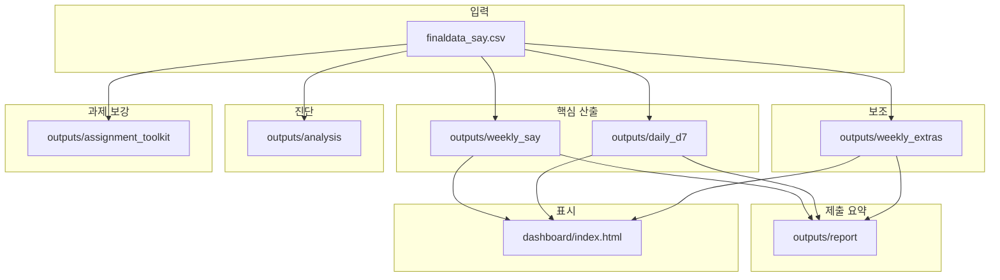

# 프로젝트 구조 · 역할 · 겹침 한눈에 보기

`finaldata_say.csv`를 기준으로 **입력은 하나**, **산출 폴더는 역할별로 쪼개져** 있습니다. 아래만 순서대로 보면 “뭐가 뭔지” 잡히도록 정리했습니다.

**더 짧은 한 장 요약**: [`docs/MAP.md`](MAP.md) (스크립트 이름·실행 순서·폴더 트리).

---

## 1. 층 나누기 (이렇게 기억하면 됨)

| 층 | 의미 | 포함 |
|----|------|------|
| **입력** | 노트북 전처리에서 만든 파일 | `finaldata_say.csv` (이 레포의 학습·분석 스크립트는 **이 파일만** 읽음) |
| **핵심 파이프라인** | 제출·운영에 쓸 **본 결과** | `weekly_say` (주간) + `daily_d7` (일 D+7) |
| **보조 실험** | 같은 주간 표로 **비교용 지표만** | `weekly_extras` |
| **진단** | 본 파이프라인과 **숫자가 비슷해 보일 수 있는** 추가 분석 | `analysis` |
| **과제 보강 툴킷** | 프로파일·전통시계열·분위수·PDP·비용·LP·Plotly·SHAP interaction | `assignment_toolkit` |
| **제출·지표 묶음** | 기존 JSON만 읽어 보고용 md/csv | `outputs/report/` (`report_bundle.py`) |
| **대시보드** | 위 JSON/PNG를 **읽어서만** HTML 생성 | `build_dashboard.py` → `dashboard/` |

---

## 2. 스크립트 ↔ 산출 폴더 (단일 대응)

| 스크립트 | 쓰는 입력 | 쓰는 공통 코드 | 산출 폴더 | 비고 |
|----------|-----------|----------------|-----------|------|
| `pipeline_weekly_say.py` | `finaldata_say.csv` | (자체) | **`outputs/weekly_say/`** | 주간 **본 모델** + SHAP + 시나리오 JSON |
| `pipeline_daily_d7.py` | `finaldata_say.csv` | (자체) | **`outputs/daily_d7/`** | 일 단위 **D+7** 단계, SHAP, 시계열 |
| `pipeline_weekly_extras.py` | `finaldata_say.csv` | `import pipeline_weekly_say` | **`outputs/weekly_extras/`** | RF, XGB Grid, LSTM 지표 **JSON만** |
| `pipeline_analysis.py` | `finaldata_say.csv` | `import pipeline_weekly_say` | **`outputs/analysis/`** | 혼동행렬·지점/계절·임계값·룩백·품질 등 **진단 전용** |
| `pipeline_assignment_toolkit.py` | `finaldata_say.csv` | `import pipeline_weekly_say` | **`outputs/assignment_toolkit/`** | 프로파일·statsmodels·분위수 LGB·PDP·비용표·PuLP·Plotly·SHAP interaction |
| `report_bundle.py` | 기존 JSON 읽기만 | `paths` | **`outputs/report/`** | `report_metrics.md` + 시나리오·활동 매핑 CSV/MD |
| `build_dashboard.py` | (파일 읽기만) | `paths` | **`dashboard/`** + `dashboard/_figures/` | 산출물 **복사·요약**, 학습 안 함 |

**루트 Python**: 위 실행 스크립트 7개 + 경로 정의 `paths.py` + 한글 폰트 `plot_config.py` 입니다. (구 이름: `weekly_say_pipeline.py` 등 → `docs/MAP.md` 참고)

---

## 3. “겹침” 정리 — 겉으로 비슷해 보이는 것

### 3.1 같은 데이터 가공 로직 (의도된 공유, 중복 아님)

- **`build_weekly_supervised` / `daily_to_weekly` / `time_mask`**  
  - **정의(소스)**: `pipeline_weekly_say.py` 한 곳.  
  - **재사용**: `pipeline_weekly_extras.py`, `pipeline_analysis.py` 등이 import.  
  - → **코드 중복이 아니라 한 모듈을 같이 씀.**

### 3.2 둘 다 “주간 + LGB + 홀드아웃 15%” (개념은 겹침, **역할은 다름**)

| 구분 | `pipeline_weekly_say` | `pipeline_analysis` |
|------|------------------------|---------------------------|
| 목적 | **본 지표·SHAP·시나리오·대시보드 입력** | **오류 패턴·베이스라인·임계값·룩백 민감도** |
| 산출 | `weekly_metrics.json` 등 `weekly_say/` | `outputs/analysis/` 전부 |
| 모델 | LGB + XGB + 보정 + 여러 지표 | 단순화된 LGB만 (진단 속도·독립 파일) |

→ **같은 홀드아웃 날짜 컷**을 쓰도록 맞춰 두었을 뿐, **`weekly_metrics.json`을 덮어쓰거나 복제하지 않습니다.**  
→ “주간 성능의 정본”은 **`outputs/weekly_say/weekly_metrics.json`** 한 군데로 보면 됩니다.

### 3.3 둘 다 “발령 vs 세포수” 류

- `pipeline_daily_d7` 안의 **일치율** 등과  
- `pipeline_analysis`의 **일별 불일치율**은 **각각 다른 정의/단위**일 수 있음 (일 파이프라인의 enrich vs say 원본 직접 비교).  
→ 이름이 비슷해도 **서로 다른 스크립트 출력**으로 보면 됨.

### 3.5 `pipeline_analysis` vs `pipeline_assignment_toolkit`

- **`analysis`**: 오류·스트라타·룩백 ablation·일별 품질 등 **모델 검증·EDA 성격**.  
- **`assignment_toolkit`**: 과제 문구에 맞춘 **보고용 도구 묶음** (프로파일, PDP, Plotly, PuLP 예시, 분위수, SHAP interaction).  
→ 둘 다 주간 표·홀드아웃을 쓸 수 있으나 **산출 폴더가 다르므로** 제출 시 역할만 구분하면 됩니다.

### 3.4 대시보드 `_figures/` vs `outputs/*/png`

- **정본 그래프**: `outputs/weekly_say/`, `outputs/daily_d7/`  
- **`dashboard/_figures/`**: `build_dashboard.py`가 빌드 시 **복사본** (웹 서버를 `dashboard`만 루트로 띄울 때 쓰기 위함).  
→ 수정·재학습 후에는 **`build_dashboard.py` 다시 실행**해야 HTML과 그림이 맞음.

---

## 4. 추천 실행 순서 (혼란 줄이기)

1. 노트북 등으로 **`finaldata_say.csv`** 갱신  
2. **`python3 pipeline_weekly_say.py`** → `outputs/weekly_say/`  
3. **`python3 pipeline_daily_d7.py`** → `outputs/daily_d7/`  
4. (선택) **`python3 pipeline_weekly_extras.py`** → `outputs/weekly_extras/`  
5. (선택) **`python3 pipeline_analysis.py`** → `outputs/analysis/`  
6. (선택) **`python3 pipeline_assignment_toolkit.py`** → `outputs/assignment_toolkit/` (과제 보강·보고용)  
7. **`python3 report_bundle.py`** → `outputs/report/` (`report_metrics.md`, `scenario_activity_map.*`) — 주간·일·extras JSON이 있을 때  
8. **`python3 build_dashboard.py`** → `dashboard/index.html` + `_figures/`  

---

## 5. 문서 위치

| 문서 | 내용 |
|------|------|
| `outputs/README.txt` | **산출 폴더별 파일 목록** (빠른 참조) |
| `docs/STRUCTURE.md` | **이 문서** — 전체 구조·겹침 설명 |
| `docs/MAP.md` | 스크립트·실행 순서·디렉터리 **한 장 요약** |
| `docs/pipelines/*.md` | 스크립트별 상세 (흐름도 포함) |
| `docs/pipelines/pipeline_assignment_toolkit.md` | **`pipeline_assignment_toolkit.py`** 단계·산출 설명 |
| `docs/PYTHON_ENV.md` | **`_ctypes` 없음·pyenv 3.14** 등 환경 오류 대응 |

---

## 6. 재현성 (MLOps 최소)

- **`requirements.txt`** + 스크립트 내 **고정 `random_state`** + 위 **실행 순서**를 보고서에 적으면 됩니다.  
- **DVC** 등은 미도입 — 필요 시 나중에 데이터/모델 아티팩트만 분리하면 됩니다.

## 7. 앞으로 구조를 더 단정히 하고 싶다면 (선택 과제)

- `src/` 아래로 파이프라인만 옮기고 루트에는 `run_weekly.sh` 한 줄 — **원하면** 그때 리팩터링.  
- 지금은 **폴더 이름 = 역할** (`weekly_say`, `daily_d7`, `weekly_extras`, `analysis`, `assignment_toolkit`)만 지켜도 충분히 구분 가능합니다.
