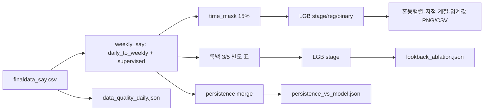

# `pipeline_analysis.py` → `outputs/analysis/`

전체 구조·다른 스크립트와의 겹침은 **`docs/STRUCTURE.md`** 를 먼저 보세요.

주간 지도학습 표를 `pipeline_weekly_say`와 동일하게 쌓고, **같은 시간 홀드아웃(15%)** 에서 **LightGBM** 단계·회귀·이진을 한 번 더 학습해 **오류 구조·베이스라인·민감도**를 뽑는 보조 스크립트입니다. `weekly_metrics.json`을 대체하지 않습니다.

## 포함 분석

| 항목 | 산출 |
|------|------|
| 일별 데이터 품질 | 지점별 조사일 간격 중앙값, 열별 결측 비율 상위, 발령코드 vs 세포수 임계 단계 불일치율 |
| 혼동행렬 | 홀드아웃 **발령단계** 예측 `confusion_matrix_stage.png` + CSV |
| 지점·계절 | `metrics_by_site*`, `metrics_by_season*` (정확도·이진 recall 등) |
| 저수율 삼분위 | `lw4_mean_저수율(%)_mean` 있으면 구간별 지표 CSV |
| 이진 임계값 스윕 | `threshold_binary_lgb.csv/png` (recall / precision / F1 vs 임계값) |
| 룩백 ablation | 메인 창 **3주 / 4주 / 5주** (`L3`/`L4`/`L5`) 각각 별도 표·특성으로 단계 LGB 학습 → `lookback_ablation.json` |
| Persistence 베이스라인 | **직전 주** 단계·세포수 max로 다음 주를 맞출 때 vs LGB → `persistence_vs_model.json` |

## 실행

```bash
/usr/bin/python3.10 pipeline_analysis.py
```

`matplotlib`, `lightgbm` 필요. 기본 `python3`에 패키지가 없으면 3.10 등 다른 인터프리터를 사용하세요.

## Mermaid



## 해석 시 참고

- **단계 정확도**에서 persistence가 LGB보다 높을 수 있습니다(상태가 잘 이어지는 구간). 그 경우 **macro F1·이진 AUC·회귀 R²**로 모델 이득을 같이 봅니다.
- 룩백 **L4가 기본 파이프라인**과 동일 구조이며, L3/L5는 행 수·특성 수가 달라 지표만 나란히 비교하는 용도입니다.
