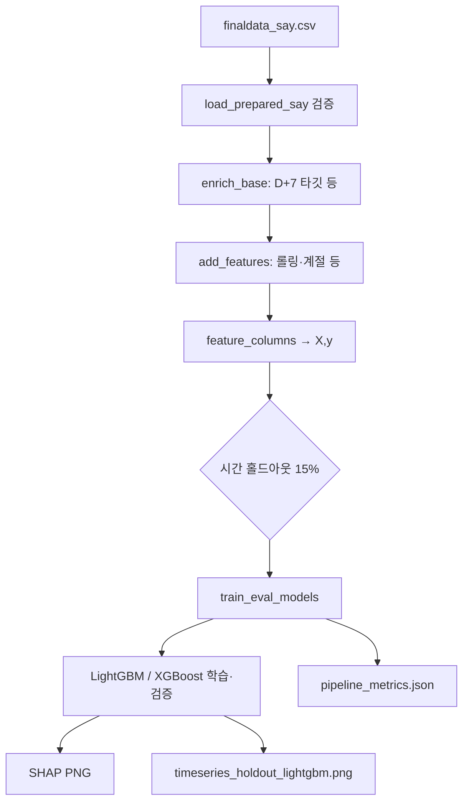

# `pipeline_daily_d7.py` → `outputs/daily_d7/`

## 한 줄 요약

**일 단위** 관측으로 **7일 뒤(D+7)** 같은 지점의 **발령단계(코드)** 를 예측합니다. 입력은 **`finaldata_say.csv`만** 사용하며, 이 파일은 스크립트가 **덮어쓰지 않습니다**.

## 무엇을 하는가

| 단계 | 내용 |
|------|------|
| 로드 | `finaldata_say.csv` 필수 열 검증 후 로드 |
| 보강 | 지점별 정렬, 발령단계·세포수 기준 단계, 연속일 초과 플래그, **D+7 타깃** `target_발령단계_D7_코드` 등 |
| 특성 | 7일 롤링 평균·강수 누적, 전주 대비 변화, 계절·채수위치 코드 등 수치형 열 |
| 분할 | **시간 홀드아웃** (고유 조사일 기준 약 15% 후반을 검증) |
| 모델 | **LightGBM** / **XGBoost** 다중 분류 (클래스 수는 데이터에 등장하는 단계에 맞춤) |
| 설명 | LightGBM 기준 **SHAP** 막대·beeswarm(한 클래스) |
| 시각 | 검증 구간 **실제 vs LightGBM 예측** 단계 시계열(지점별 패널) |

## 산출물 (`outputs/daily_d7/`)

| 파일 | 무엇을 보면 되는가 |
|------|---------------------|
| `pipeline_metrics.json` | `input_csv`, `input_rows`, `modeling_rows`, `target`, `features_n`, `classes`, **`metrics`**(LGB/XGB accuracy·f1_macro·classification `report` 문자열), `발령단계_vs_세포수_일치율` |
| `shap_mean_abs_bar.png` | 검증 표본에서 클래스 평균 **mean \|SHAP\|** 상위 특성 |
| `shap_beeswarm_class.png` | 한 클래스에 대한 SHAP **dot** 요약 (데이터 분포에 따라 대표 클래스 선택) |
| `timeseries_holdout_lightgbm.png` | **검증 구간**에서 지점별 **실제 단계 코드 vs 예측** |
| `holdout_predictions_daily_d7.csv` | 검증 구간 **행 단위**: 조사일·지점·당일 발령·**D+7 정답 코드/이름**·LightGBM·XGBoost 예측 코드/이름(제출·오차 분석용) |

## 어떤 결과가 “좋은” 편인가

- **`metrics.lightgbm` / `metrics.xgboost`의 `accuracy`, `f1_macro`**: 다중 분류 전체 성능. 클래스 불균형이 있으면 **f1_macro**를 함께 봅니다.
- **`report`**: 단계별 precision/recall — **관심·경계**에서 recall이 너무 낮으면 조기경보 관점에서 불리할 수 있습니다.
- **시계열 그림**: 후반 홀드아웃에서 예측 곡선이 실제와 같이 움직이는지 **운영 직관** 확인용입니다.
- **`발령단계_vs_세포수_일치율`**: 공식 발령과 세포수 임계 기반 단계의 일치 정도(데이터 품질·정의 참고).

## 실행

```bash
python3 pipeline_daily_d7.py
```

(필요 패키지: pandas, scikit-learn, lightgbm, xgboost, matplotlib, shap 등)

## 흐름도 (Mermaid)



## 다른 파이프라인과의 관계

- **주간** 예측·시나리오는 `pipeline_weekly_say.py` (`outputs/weekly_say/`).
- **보조 모델 비교**(RF, XGB Grid, LSTM)는 `pipeline_weekly_extras.py` (`outputs/weekly_extras/`).
- 일 파이프라인은 **D+7 단계**에 초점을 맞춘 별도 제품이며, `finaldata_say.csv` 생성은 노트북 전처리 담당입니다.
