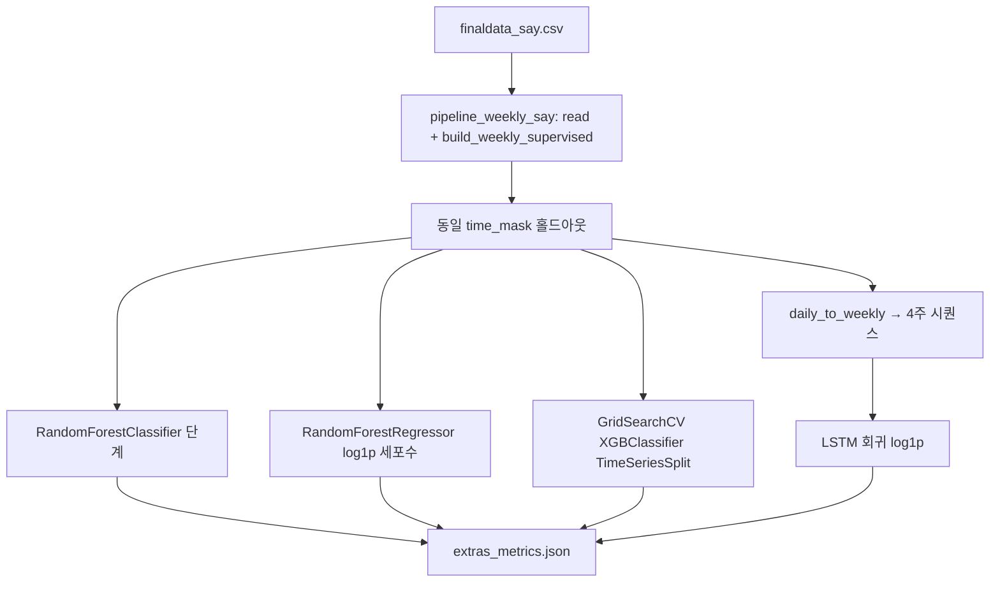

# `pipeline_weekly_extras.py` → `outputs/weekly_extras/`

## 한 줄 요약

**주간 지도학습 표**는 `pipeline_weekly_say`와 **동일한 방식**으로 `finaldata_say.csv`에서 만들고, 그 위에 **보조 모델**만 추가로 돌립니다: **RandomForest**(단계 분류 + log1p 세포수 회귀), **XGBoost + GridSearchCV(TimeSeriesSplit)** (단계), **LSTM**(지점별 주간 시퀀스 4주→다음 주 log1p 세포수). **기존 `weekly_say` 산출물은 수정·삭제하지 않습니다.**

## 무엇을 하는가

| 블록 | 내용 |
|------|------|
| 데이터 | `pipeline_weekly_say._read_say()`, `build_weekly_supervised()` → `y_cyano_max_next`, `y_stage_max_next` 등 동일 타깃 |
| 분할 | `pipeline_weekly_say.time_mask()` — **시간 홀드아웃 15%** (주 단위) |
| RandomForest | `RandomForestClassifier`: 다음 주 **발령단계(0–3)** / `RandomForestRegressor`: **log1p(다음 주 max 세포수)** |
| XGBoost Grid | 학습 구간만 **TimeSeriesSplit(3)** 으로 CV, `f1_macro` 최대인 하이퍼파라미터 선택 후 **홀드아웃** 평가 |
| LSTM | `daily_to_weekly()`로 주간 원시 집계 → 지점별 정렬 후 **연속 4주 창** → 다음 주 `log1p(total_cyano_max)` 회귀 (Keras, 시계열 순 분할 홀드아웃) |
| 출력 | **`extras_metrics.json` 단일 파일** (그림 PNG는 생성하지 않음) |

## 산출물 (`outputs/weekly_extras/`)

| 파일 | 무엇을 보면 되는가 |
|------|---------------------|
| `extras_metrics.json` | 모든 지표가 여기에 JSON으로 정리됨 |

### `extras_metrics.json` 키 설명

| 키 | 의미 |
|----|------|
| `input_csv` | 사용한 say 파일 경로 |
| `random_forest_classifier_stage` | `accuracy`, `f1_macro` (다음 주 **단계** 4-class) |
| `random_forest_regressor_log1p_cyano` | `r2`, `mae_log`, `mae_cells_approx` (expm1 근사로 cells 스케일 MAE) |
| `xgboost_gridsearch_stage` | `best_params`, `best_cv_f1_macro`(학습 구간 TS-CV), `holdout_accuracy`, `holdout_f1_macro` |
| `xgboost_gridsearch_error` | XGB 미설치·학습 실패 시 문자열 |
| `lstm_weekly_sequence` | 성공 시 `lstm_r2_log`, `lstm_mae_log`, `lstm_mae_cells_approx`, 샘플 수·특성 수 등 / 실패 시 `skipped`, `reason` |

## 어떤 결과를 어떻게 읽을까

- **주력 파이프라인(`weekly_say`)과 숫자를 직접 비교**하면 됩니다. 같은 홀드아웃 비율·같은 표를 쓰므로, **RF vs LGB**, **Grid XGB vs LGB+XGB 앙상블** 등 **상대적 참고**에 적합합니다.
- **`best_cv_f1_macro` vs `holdout_f1_macro`**: CV는 과적합 방향으로 낙관적일 수 있어, **홀드아웃**을 최종으로 봅니다.
- **LSTM**은 시퀀스 길이·지점 수에 따라 `skipped` 될 수 있습니다(`시퀀스 샘플 부족` 등).

## 실행

스크립트 상단 주석 예시:

```bash
/usr/bin/python3.10 pipeline_weekly_extras.py
```

TensorFlow가 필요합니다(LSTM). 환경에 따라 `python3`로 대체 가능.

## 흐름도 (Mermaid)



## 다른 파이프라인과의 관계

| 항목 | `weekly_say` | `weekly_extras` (본 스크립트) |
|------|----------------|-------------------------------|
| 산출 폴더 | `outputs/weekly_say/` | `outputs/weekly_extras/` |
| 역할 | 제출·대시보드용 **주력** 모델·SHAP·시나리오 | **추가 실험** 지표 JSON만 |
| 그림 | 다수 PNG | 없음 |

`build_dashboard.py`는 `extras_metrics.json`을 읽어 대시보드에 **요약 타일**로 반영할 수 있습니다.
