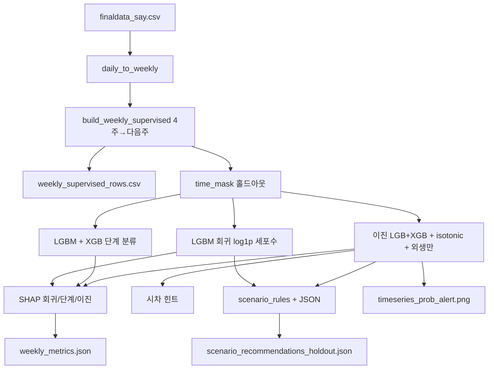

# `pipeline_weekly_say.py` → `outputs/weekly_say/`

## 한 줄 요약

**일 단위 `finaldata_say.csv`**를 주간으로 집계한 뒤, **동일 지점에서 최근 4주 패턴**으로 **다음 주**의 세포수·발령단계·**관심 이상 여부**를 예측합니다. **LightGBM**이 주력이고 **XGBoost**는 단계·이진 앙상블에 사용됩니다. **Ollama**는 선택 사항으로, 규칙 기반 시나리오를 자연어로 다듬을 때만 쓰입니다.

## 무엇을 하는가

| 단계 | 내용 |
|------|------|
| 읽기 | `_read_say()`: `finaldata_say.csv`만 로드·수치형 정리 |
| 주간화 | `daily_to_weekly()`: 주(SUN 기준)별 mean/max 등 집계 |
| 지도 학습 표 | `build_weekly_supervised()`: 각 행 = (과거 4주 특성 lw*) → **다음 주** 정답 `y_cyano_max_next`, `y_stage_max_next`, `y_alert_ge1_next` |
| 분할 | `time_mask`: **시간 순서** 홀드아웃 약 15% |
| 회귀 | LGBMRegressor → 다음 주 **log1p(주간 max 세포수)** |
| 분류 | LGBMClassifier → 다음 주 **최고 발령단계**; XGB 단계 모델과 **평균 확률 앙상블** |
| 이진 | 관심 이상: LGB + XGB 확률, **Isotonic 보정** LGB, **순 외생만** LGB 비교 |
| 운영 지표 | 경계 단계(코드 2)에 대한 **operational_boundary_f1** 등 |
| SHAP | 회귀·단계·이진(검증 부분집합 y=1 / y=0) 막대 그림 |
| 시나리오 | `scenario_rules()` + 검증 구간 메타 → `scenario_recommendations_holdout.json` |
| 시각 | 검증 구간 **관심 이상 확률** 시계열(LGB / 앙상블 / 보정) |

## 산출물 (`outputs/weekly_say/`)

| 파일 | 무엇을 보면 되는가 |
|------|---------------------|
| `weekly_supervised_rows.csv` | **학습용 한 행 = 4주 룩백 + 다음 주 정답**이 붙은 표. 특성 열 이름·결측 처리 확인용. |
| `weekly_metrics.json` | `weekly_supervised_rows` 행 수, `holdout_ratio`, `feature_count`, **`metrics`** 전체. |
| `scenario_recommendations_holdout.json` | 검증 구간 각 (지점, 주)마다 확률·예측 단계·세포수·**규칙 시나리오 배열**, 선택 필드 `ollama_narrative`. |
| `shap_weekly_regression.png` | 다음 주 log1p(세포수) 회귀 모델 SHAP |
| `shap_weekly_stage.png` | 다음 주 발령단계 분류 SHAP |
| `shap_binary_subset_val_y1.png` / `..._y0.png` | 이진(관심 이상) 모델 SHAP — 검증에서 실제 1 / 0인 샘플만 |
| `timeseries_prob_alert.png` | 검증 구간 **P(다음 주 관심 이상)** 추이 비교 |
| `holdout_predictions_weekly.csv` | 검증 구간 **행 단위**: 대상 주·지점·다음 주 정답(단계·이진·세포수)·예측 단계·세포수 근사·LGB/앙상블/보정 확률·임계 0.5 이진 예측 |

### `weekly_metrics.json`의 `metrics`에서 자주 보는 키

- **`regression_log1p_cyano`**: `r2`, `mae_log`, `mae_cells_approx` (역변환 근사 오차).
- **`classification_stage`**, **`classification_stage_ensemble_lgb_xgb`**: 단계 예측 정확도·macro F1.
- **`binary_calibrated_isotonic_lgb`**: 보정 확률 기준 ROC-AUC, recall/precision(관심↑).
- **`binary_exogenous_only_lgb`**: 세포수·종·발령 lw* 제외한 **외생만** 이진 성능.
- **`operational_boundary_f1`**: **경계** 단계 맞춤 F1(이진 마스크).
- **`시차_특성_힌트_이진LGB`**: `feature_importances_` 기반 **lw1 vs lw4_mean vs lw4_slope** 요약(대시보드 막대와 연계).

## LSTM은 이 스크립트에 없습니다

**`pipeline_weekly_say.py`는 LSTM을 쓰지 않습니다.** 주간 예측의 주력은 **LightGBM / XGBoost(트리)** 입니다.

**LSTM**은 `pipeline_weekly_extras.py`에서만 돌며, 역할은 다음과 같습니다.

| 항목 | 설명 |
|------|------|
| 입력 | 지점별 **주간 집계표**에서 **연속 4주**를 시퀀스 `(4 × 특성)` 로 쌓음 |
| 출력 | **다음 주** `total_cyano_max`에 대응하는 **`log1p` 회귀** (세포수 규모 추정) |
| 위치 | 발령 **단계 분류**용이 아니라, 트리 회귀와 비교할 **보조 벤치마크** |
| 산출 | `outputs/weekly_extras/extras_metrics.json` 의 `lstm_weekly_sequence` 만 (PNG·SHAP 없음) |
| 데이터 | 샘플이 너무 적으면 `skipped: true` 로 건너뜀 |

같은 `finaldata_say.csv`·같은 주간 지도학습 행(`build_weekly_supervised` 등)을 **import 해 재사용**하므로, 홀드아웃 비율도 extras 스크립트와 맞춰 두고 지표만 나란히 보면 됩니다.

## 어떤 결과가 “좋은” 편인가

- **관심 이상 재현율**(`recall_alert`)이 과제 목적상 중요할 때가 많음 — 대신 false alarm이 늘 수 있으니 **precision**과 함께 봅니다.
- **보정(isotonic) ROC-AUC**가 캘리브레이션된 확률의 순위·신뢰도 참고에 유리합니다.
- **시나리오 JSON**은 수치 모델과 별도인 **규칙 엔진** 출력이므로, 확률·유입 기준 등이 도메인과 맞는지 검토합니다.

## 실행

```bash
python3 pipeline_weekly_say.py
```

선택: `OLLAMA_NARRATIVE=1 OLLAMA_MODEL=llama3.2 OLLAMA_HOST=http://127.0.0.1:11434 python3 pipeline_weekly_say.py`

## 흐름도 (Mermaid)



## 다른 파이프라인과의 관계

- **일 단위 D+7**은 `pipeline_daily_d7.py` → `outputs/daily_d7/`.
- **RF / GridSearch XGB / LSTM** 보조 지표는 `pipeline_weekly_extras.py` → `outputs/weekly_extras/` (`pipeline_weekly_say`의 `_read_say`, `build_weekly_supervised`, `time_mask` 등을 **import** 해 동일 주간 표·분할로 평가). LSTM 상세는 위 **「LSTM은 이 스크립트에 없습니다」** 절 참고.
